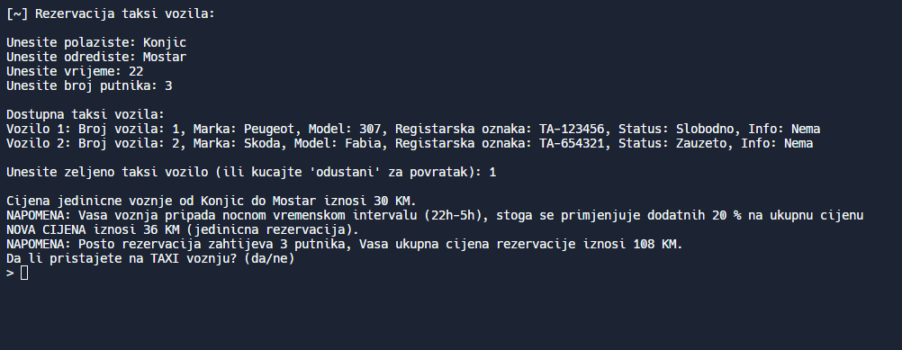

# 🚕 Taxi System Simulation

The Taxi System Simulation project is a shell (bash) scripting application demonstrating proficiency in shell programming. It combines CRUD (Create, Read, Update, Delete) operations with additional features across two interfaces: admin and user. Upon login, users are directed to either the admin or user side based on their credentials.

The system is dynamic, with predefined arrays of admins and users that can be updated via functions to add new users. The admin interface provides options to add, edit and delete taxi vehicle information. Editable parameters include the vehicle's license plate number (identifier), status (available or occupied) and other descriptive details to help users identify vehicles.

The user interface offers functionality for reserving taxis by specifying the starting point, destination, reservation time, and number of passengers. The system calculates the reservation price based on these factors, using a randomized base fare combined with user inputs (shown in the Preview section below). Users can also view their history of past taxi reservations.

## 👀 Preview



## ⚙️ Installation

The Taxi System Simulation project can be easily installed without the need for any additional software. It is designed to run on most operating systems, ensuring compatibility and flexibility. The shell script, which powers the simulation, can be executed on various platforms, including Linux, macOS, and other Unix-like systems.

Steps to run shell script:
1. Download the project file: "main_taxi.sh"
2. Open a terminal or command prompt on your operating system.
3. Navigate to the directory where the project files are located. For example, if the file is on your desktop, use the following command:
```bash
cd ~/Desktop
```
4. Make sure the shell script file has executable permissions. If not, grant the necessary permissions using the following command:
```bash
chmod +x main_taxi.sh
```
5. Run the shell script by executing the following command:
```bash
./main_taxi.sh
```

The Taxi System Simulation has been created and thoroughly tested on Zorin OS Lite, a Linux distribution.

## ✉️ Contact

[](https://www.linkedin.com/in/demir-halilbasic/) [](https://www.youtube.com/@DemkyDesignHub)


## 👍 Feedback

I value your feedback and would appreciate hearing your thoughts on the Taxi System Simulation project. Please feel free to share any comments or suggestions you may have. Thank you for taking the time to provide feedback.
